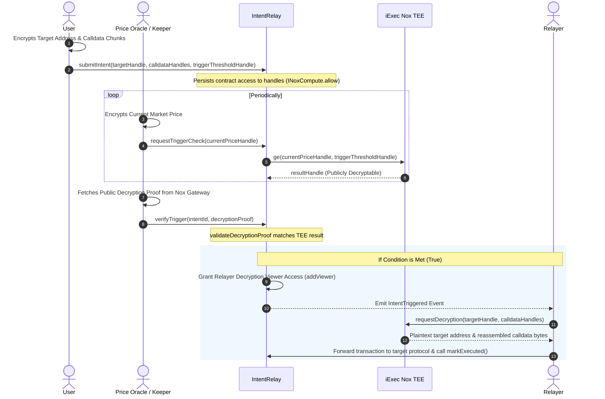

# Arcana — Confidential Intent Relay on iExec Nox

Arcana is a **Confidential Intent Relay** built on the iExec Nox protocol. It enables users to submit private, off-chain encrypted intents (such as multisig treasury payouts, limit orders, and stop-losses) where target contract addresses, transaction calldata, and price thresholds remain completely encrypted inside TEE hardware until execution conditions are met.

Rather than requiring protocols to modify their smart contracts or adopt custom interfaces, Arcana routes confidential payloads through **existing, unmodified, real-world protocols**. As a primary showcase, Arcana routes confidential treasury payouts through a live **Gnosis Safe Multisig Proxy (v1.3.0)** on Ethereum Sepolia.

---

## Architecture

The system consists of three main roles: the **User** (intent owner), the **Oracle/Keeper** (price feed), and the **Relayer** (executor).



---

## Repository Contents

*   **[`scripts/demo_safe.ts`](file:///home/replytim/Desktop/Arcana/scripts/demo_safe.ts)**: **Headline Demonstration**: End-to-end Sepolia execution demo routing a private payout transaction through an unmodified Gnosis Safe Proxy (v1.3.0).
*   **[`frontend/`](file:///home/replytim/Desktop/Arcana/frontend/)**: Responsive dark-themed Web3 Vite dashboard allowing users to select target protocols (Gnosis Safe or Mock Swap), encrypt parameters client-side, and submit intents via MetaMask.
*   **[`src/sdk/`](file:///home/replytim/Desktop/Arcana/src/sdk/)**: Reusable JavaScript/TypeScript client SDK (`ArcanaClient`) encapsulating padding, chunking, EIP-712 credential signing, on-chain submission, and parallelized decryption logic.
*   **[`contracts/IntentRelay.sol`](file:///home/replytim/Desktop/Arcana/contracts/IntentRelay.sol)**: Main smart contract managing confidential intent submissions, TEE comparison requests, decryption verification, and relayer access control.
*   **[`contracts/MockSwapContract.sol`](file:///home/replytim/Desktop/Arcana/contracts/MockSwapContract.sol)**: Internal test fixture used during development to validate basic swap call encodings.
*   **[`src/relayer.ts`](file:///home/replytim/Desktop/Arcana/src/relayer.ts)**: Standalone off-chain Relayer daemon service utilizing the SDK to monitor events, decrypt payloads, and dispatch executions.
*   **[`src/keeper.ts`](file:///home/replytim/Desktop/Arcana/src/keeper.ts)**: Standalone off-chain Keeper daemon service reading market prices, requesting TEE comparisons, and submitting verification proofs.
*   **[`scripts/deploy_safe.ts`](file:///home/replytim/Desktop/Arcana/scripts/deploy_safe.ts)**: Deploys a standard Gnosis Safe Proxy (v1.3.0) on Ethereum Sepolia controlled by the user wallet.

---

## Latency Metrics (Live Ethereum Sepolia Testnet)

### 1. Minimal Swap Demo (72 bytes calldata, 2 chunks)
*   **Client Price Encryption**: **5.03s** (EIP-712 credential signing & off-chain encryption).
*   **TEE Async Comparison Latency**: **1.80s** (Unwrap phase where Sepolia TEE hardware evaluates the comparison).
*   **Relayer Decryption Latency**: **6.31s** (EIP-712 decryption verification & key retrieval).

### 2. Gnosis Safe Payout Demo (484 bytes calldata, 16 chunks)
*   **Client Parameters Encryption**: **18.94s** (Encrypting trigger condition, target address, and 16 calldata chunks).
*   **TEE Async Comparison Latency**: **12.04s** (TEE worker enclave execution on testnet).
---

## Verified On-Chain Deployments & Live Sepolia Transactions

### Smart Contracts
* **[`IntentRelay.sol`](https://eth-sepolia.blockscout.com/address/0x9BF3f5db0442a59A074B728cD23F719D57375A9b#code)**: Deployed & Verified on Blockscout / Sourcify at `0x9BF3f5db0442a59A074B728cD23F719D57375A9b`.
* **Gnosis Safe Singleton (v1.3.0)**: Official Canonical Safe Master Copy on Sepolia at `0x69f4d1788e39c87893c980c06edf4b7f686e2938`.
* **Gnosis Safe Proxy**: Deployed Safe Proxy instance at `0xC40ec2fD95830F37D5744489018693031c8AC6eE`.
* **Chainlink Price Feed**: Official Sepolia ETH/USD Aggregator at `0x694AA1769357215DE4FAC081bf1f309aDC325306`.

### Live Sepolia Execution Pipeline Transactions
* **Safe Proxy Deployment**: [`0xf981f814f9386715...`](https://sepolia.etherscan.io/tx/0xf981f814f93867154ef9e6a44b83755747f6617a230efc5205c6b66cbd6c1841)
* **Safe Funding (0.005 ETH)**: [`0xbe54bc91b7ee562c...`](https://sepolia.etherscan.io/tx/0xbe54bc91b7ee562c7ed0ca19c7b9b6d3eca47137ea1b94c92468e2ffaf214c80)
* **`submitIntent` (Safe Payout)**: [`0xdeac5438e579de06...`](https://sepolia.etherscan.io/tx/0xdeac5438e579de0607410bdc903850f87ebfbfe5fb8fad8df55924db4417fbb2)
* **`requestTriggerCheck` (Keeper)**: [`0xe53fcdbe244ce210...`](https://sepolia.etherscan.io/tx/0xe53fcdbe244ce21064d8efc2a0022066666121ea4fc6182ffb7220802c2bbe34)
* **`verifyTrigger` (TEE Verification)**: [`0xac1aa3e5b375500a...`](https://sepolia.etherscan.io/tx/0xac1aa3e5b375500aa77728c63eef1713e2499b74e3979d2a8aa24d7dd62d33aa)
* **Gnosis Safe Payout Execution**: [`0xb7a2bad9cbd1fa8...`](https://sepolia.etherscan.io/tx/0xb7a2bad9cbd1fa8a80da9a36633e4ca6bbf82474408b5653facb5f95f63c3280)
* **`markExecuted`**: [`0x762bcce93ddec60f...`](https://sepolia.etherscan.io/tx/0x762bcce93ddec60ffe2ed4fbb47fff2c7515be8b914efdd64ef00004fea48fe2)

---

## Setup & Local Development

### 1. Prerequisites
Ensure you have the modern `docker compose` CLI plugin installed rather than the legacy standalone `docker-compose` binary:
```bash
docker compose version
```

### 2. Installation
Clone the repository and install dependencies:
```bash
npm install
```

### 3. Running Local Integration Tests
The project uses the `@iexec-nox/nox-hardhat-plugin` to spin up the local off-chain stack (Nox KMS, handle gateway, ingestor, runner, NATS) inside Docker:
```bash
npx hardhat test
```

### 4. Running the Web Frontend Dashboard
Scaffolded under the `frontend` folder. To run locally:
```bash
cd frontend
npm install
npm run dev
```

### 5. Running the Gnosis Safe Sepolia Demo
Create a `.env` file in the root directory:
```env
PRIVATE_KEY=your_sepolia_private_key
```

Deploy the Gnosis Safe proxy on Sepolia:
```bash
npx hardhat run scripts/deploy_safe.ts --network sepolia
```

Run the end-to-end Safe payout demo:
```bash
npx hardhat run scripts/demo_safe.ts --network sepolia
```

---

## Design Choices & Tradeoffs

1. **Whitelisted Price Oracles**: Gated `requestTriggerCheck` to prevent arbitrary price manipulation. Gated by a whitelisted `priceOracle` address.
2. **Parallelized Decryption**: Safe execution calldata is split into multiple 32-byte chunks. The SDK decrypts all chunks concurrently in parallel (`Promise.all`) once the subgraph indexes the permission change, eliminating linear network latency.
3. **Calldata Chunking**: Because the current Nox JS SDK only supports encrypting 32-byte numeric types (`uint256`), generic swap/multisig calldata of arbitrary length is padded, divided into 32-byte chunks, and encrypted client-side. The relayer decrypts these chunks off-chain and trims the padding dynamically using the on-chain stored `calldataLength`.

---

## Known Limitations & Future Work

1. **Whitelisted Oracle Key Model**: In the current iteration, price check requests are gated by a whitelisted `priceOracle` address. In production, this can be decentralized into a network of independent oracle keepers verifying multi-source prices.
2. **Oracle Feed Staleness & Freshness Verification**: The keeper reads live price feeds directly from Chainlink Sepolia aggregators. Production deployments would incorporate explicit staleness thresholds (`block.timestamp - updatedAt < maxStaleness`) directly within contract-level assertions.
3. **Public Mempool Relayer Transactions**: While intent target addresses and calldata payloads remain encrypted off-chain until execution, the final execution transaction dispatched by the Relayer daemon enters the standard Ethereum transaction pool. Integrating private transaction RPC endpoints (e.g. Flashbots Protect or MEV-Share) would eliminate frontrunning at execution time.
