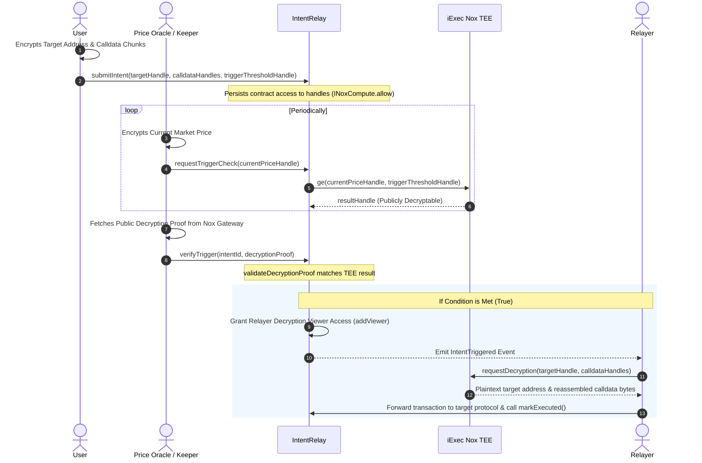

# Arcana — Confidential Intent Relay on iExec Nox

Arcana is a **Confidential Intent Relay** built on the iExec Nox protocol. It allows users to submit private DeFi intents (such as encrypted limit orders, stop-losses, and yield-farming triggers) where the target protocol address, transaction calldata, and price thresholds remain completely encrypted inside TEE hardware until execution conditions are met. 

The target protocol remains completely unmodified. Once a whitelisted price oracle updates the trigger condition on-chain, the relay contract dynamically grants decryption viewer permissions to a dedicated relayer service. The relayer decrypts the execution payload off-chain and forwards it directly to the target contract in a single sequential block execution.

---

## Architecture

The system consists of three main roles: the **User** (intent owner), the **Oracle/Keeper** (price feed), and the **Relayer** (executor).



---

## Repository Contents

*   **[`contracts/IntentRelay.sol`](file:///home/replytim/Desktop/Arcana/contracts/IntentRelay.sol)**: The main smart contract managing confidential intent submissions, TEE comparison requests, decryption verification, and relayer access control.
*   **[`src/relayer.ts`](file:///home/replytim/Desktop/Arcana/src/relayer.ts)**: A standalone off-chain Relayer daemon service that monitors trigger events, decrypts swap payloads, and executes them.
*   **[`src/keeper.ts`](file:///home/replytim/Desktop/Arcana/src/keeper.ts)**: A standalone off-chain Keeper daemon service that evaluates prices, requests trigger comparisons, and submits verification proofs on-chain.
*   **[`test/KeeperLoop.test.ts`](file:///home/replytim/Desktop/Arcana/test/KeeperLoop.test.ts)**: Integration tests simulating unsuccessful checks (price below trigger) and successful checks.
*   **[`scripts/demo.ts`](file:///home/replytim/Desktop/Arcana/scripts/demo.ts)**: A complete end-to-end demo execution script on Ethereum Sepolia.

---

## Latency Metrics (Live Ethereum Sepolia Testnet)

*   **Client Price Encryption**: **5.03s** (EIP-712 credential signing & off-chain encryption).
*   **TEE Async Comparison Latency**: **1.80s** (Unwrap phase where the real Sepolia TEE hardware evaluates the comparison and posts the result handle).
*   **Relayer Decryption Latency**: **6.31s** (EIP-712 relayer decryption verification & key retrieval).

---

## Setup & Local Development

### 1. Prerequisites
Ensure you have the modern `docker compose` CLI plugin installed rather than the legacy standalone `docker-compose` binary:
```bash
docker compose version
```

### 2. Installation
Clone the repository and install the dependencies:
```bash
npm install
```

### 3. Running Local Integration Tests
The project uses the `@iexec-nox/nox-hardhat-plugin` to spin up the local off-chain stack (Nox KMS, handle gateway, ingestor, runner, NATS) inside Docker and runs mocha tests:
```bash
npx hardhat test
```

### 4. Running the Ethereum Sepolia Demo
Create a `.env` file in the root directory:
```env
PRIVATE_KEY=your_sepolia_private_key
```

Deploy the contracts to Ethereum Sepolia:
```bash
npx hardhat run scripts/deploy.ts --network sepolia
```

Run the end-to-end Sepolia demonstration script:
```bash
npx hardhat run scripts/demo.ts --network sepolia
```

---

## Design Choices & Tradeoffs

1. **Gated Price Feeds**: To prevent arbitrary actors from submitting forged prices and forcing intent executions, `requestTriggerCheck` is gated by a whitelisted `priceOracle` address. In production, this address would be a decentralized contract oracle (e.g. Chainlink or Uniswap TWAP).
2. **Dynamic Subgraph Indexer Retries**: Off-chain decryption requires the gateway to check on-chain viewer status. Since subgraph indexers on live testnets have latency, the relayer implements a polling retry loop to handle the indexer sync delay gracefully.
3. **Calldata Chunking**: Because the current Nox JS SDK only supports encrypting 32-byte numeric types (`uint256`), generic swap calldata of arbitrary length is padded, divided into 32-byte chunks, and encrypted client-side. The relayer decrypts these chunks off-chain and trims the padding dynamically using the on-chain stored `calldataLength`.
