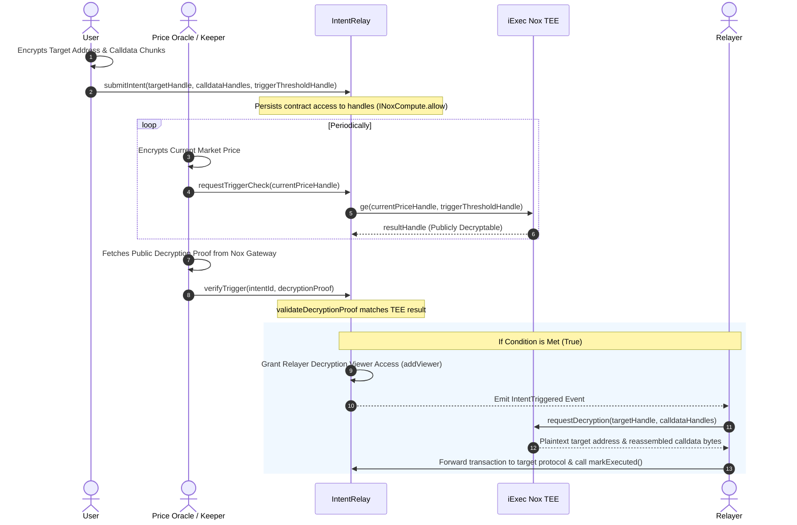

# Arcana — Confidential Intent Relay on iExec Nox

Arcana is a **Confidential Intent Relay** built on the iExec Nox protocol. It enables users to submit private, off-chain encrypted intents (such as multisig treasury payouts, limit orders, and stop-losses) where target contract addresses, transaction calldata, and price thresholds remain completely encrypted inside TEE hardware until execution conditions are met.

Rather than requiring protocols to modify their smart contracts or adopt custom interfaces, Arcana routes confidential payloads through **existing, unmodified, real-world protocols**. As a primary showcase, Arcana routes confidential treasury payouts through a live **Gnosis Safe Multisig Proxy (v1.3.0)** on Ethereum Sepolia.

---

## Architecture

The system consists of three main roles: the **User** (intent owner), the **Oracle/Keeper** (price feed), and the **Relayer** (executor).


```mermaid
sequenceDiagram
    autonumber
    actor User
    actor Oracle as Price Oracle / Keeper
    participant Contract as IntentRelay
    participant Nox as iExec Nox TEE
    actor Relayer

    User->>User: Encrypts Target Address & Calldata Chunks
    User->>Contract: submitIntent(targetHandle, calldataHandles, triggerThresholdHandle)
    Note over Contract: Persists contract access to handles (INoxCompute.allow)
    
    loop Periodically
        Oracle->>Oracle: Encrypts Current Market Price
        Oracle->>Contract: requestTriggerCheck(currentPriceHandle)
        Contract->>Nox: ge(currentPriceHandle, triggerThresholdHandle)
        Nox-->>Contract: resultHandle (Publicly Decryptable)
    end

    Oracle->>Oracle: Fetches Public Decryption Proof from Nox Gateway
    Oracle->>Contract: verifyTrigger(intentId, decryptionProof)
    Note over Contract: validateDecryptionProof matches TEE result
    
    rect rgb(240, 248, 255)
        Note over Contract, Relayer: If Condition is Met (True)
        Contract->>Contract: Grant Relayer Decryption Viewer Access (addViewer)
        Contract-->>Relayer: Emit IntentTriggered Event
        Relayer->>Nox: requestDecryption(targetHandle, calldataHandles)
        Nox-->>Relayer: Plaintext target address & reassembled calldata bytes
        Relayer->>Contract: Forward transaction to target protocol & call markExecuted()
    end
```

---

## Repository Contents

*   **[`scripts/demo_safe.ts`](file:///home/replytim/Desktop/Arcana/scripts/demo_safe.ts)**: **Headline Demonstration**: End-to-end Sepolia execution demo routing a private payout transaction through an unmodified Gnosis Safe Proxy (v1.3.0).
*   **[`frontend/`](file:///home/replytim/Desktop/Arcana/frontend/)**: Responsive dark-themed Web3 Vite dashboard allowing users to select target protocols (Gnosis Safe or Mock Swap), encrypt parameters client-side, and submit intents via MetaMask.
*   **[`src/sdk/`](file:///home/replytim/Desktop/Arcana/src/sdk/)**: Reusable JavaScript/TypeScript client SDK (`ArcanaClient`) encapsulating padding, chunking, EIP-712 credential signing, on-chain submission, and parallelized decryption logic.
*   **[`contracts/IntentRelay.sol`](file:///home/replytim/Desktop/Arcana/contracts/IntentRelay.sol)**: Main smart contract managing confidential intent submissions, TEE comparison requests, decryption verification, and relayer access control.
*   **[`contracts/MockSwapContract.sol`](file:///home/replytim/Desktop/Arcana/contracts/MockSwapContract.sol)**: Internal test fixture used during development to validate basic swap call encodings.
*   **[`src/relayer.ts`](file:///home/replytim/Desktop/Arcana/src/relayer.ts)**: Standalone off-chain Relayer daemon service utilizing the SDK to monitor events, decrypt payloads, and dispatch executions with support for **Private Mempool RPC Submission** (`PRIVATE_MEMPOOL_RPC_URL`) to eliminate public mempool front-running window.
*   **[`src/keeper.ts`](file:///home/replytim/Desktop/Arcana/src/keeper.ts)**: Standalone off-chain Keeper daemon service reading market prices, requesting TEE comparisons, and submitting verification proofs.
*   **[`scripts/deploy_safe.ts`](file:///home/replytim/Desktop/Arcana/scripts/deploy_safe.ts)**: Deploys a standard Gnosis Safe Proxy (v1.3.0) on Ethereum Sepolia controlled by the user wallet.

---

## Latency Metrics (Representative Live Ethereum Sepolia Testnet Run)

### 1. Minimal Swap Demo (72 bytes calldata, 2 chunks)
*   **Client Price Encryption**: **5.03s** (EIP-712 credential signing & off-chain encryption).
*   **TEE Async Comparison Latency**: **1.80s** (Unwrap phase where Sepolia TEE hardware evaluates the comparison).
*   **Relayer Decryption Latency**: **6.31s** (EIP-712 decryption verification & key retrieval).

### 2. Gnosis Safe Payout Demo (484 bytes calldata, 16 chunks)
*   **Client Parameters Encryption**: **17.03s** (Encrypting trigger condition, target address, and 16 calldata chunks).
*   **TEE Async Comparison Latency**: **7.07s** (TEE worker enclave execution on testnet).
*   **Relayer Decryption Latency**: **12.26s** (Parallelized handle decryption & subgraph sync).

---

## Verified Evidence & Deployments

### 5a. Local Integration Test Evidence
Validated by `npx hardhat test` against the local `noxLocal` simulated TEE stack. This verifies full contract logic, boolean composition, owner indexing, and stop-loss handling in a fast, reproducible, zero-cost environment (does not by itself prove live network behavior):

- **Suite 1: IntentRelay Integration Test**
  - `Should execute a full confidential intent lifecycle: submit -> trigger -> decrypt -> execute`
- **Suite 2: Keeper Loop and Relayer Integration Test**
  - `Should evaluate price checks, fail when mock price is below trigger, and execute automatically when mock price is met`
  - `Should revert if markExecuted is called by an unauthorized non-relayer account`
  - `Should evaluate multi-condition composed encrypted triggers (AND) inside TEE enclaves on-chain`
  - `Should index intent IDs per owner and return via getOwnerIntents`
  - `Should evaluate Stop-Loss triggers using CompareOp.LE`
- **Suite 3: Relayer Execution Payload & Decryption Test**
  - `Should decrypt execution payload and execute target transaction`
- **Suite 4: Nox Round Trip Test**
  - `Should encrypt, register on-chain, and decrypt a uint256 value`

### 5b. Live Hosted Deployment (Sepolia + Vercel + Railway)
Validated on public Ethereum Sepolia testnet with off-chain Keeper and Relayer daemons running continuously:

#### Active Smart Contracts (Current Live Deployment)
* **[`IntentRelay.sol`](https://sepolia.etherscan.io/address/0xc67C9e9b8b3E1191D2Ce3f097644bf6F2649545D#code)**: Deployed & Verified at `0xc67C9e9b8b3E1191D2Ce3f097644bf6F2649545D` (Deployment Tx: [`0x30a83da0...`](https://sepolia.etherscan.io/tx/0x30a83da02ed1938366be816612347cbacff6ba9d411d87a2e406641af3d4b9c6)).
* **Dedicated Relayer Role**: Dedicated Random Relayer Key `0x2A331463eff2603e39748B30f2b52820d160B5eA` (Not a public test key).
* **Dedicated Oracle Role**: Dedicated Price Oracle Wallet `0xBDB82a3905a3B22B32885Bad996cbc9917436534`.
* **Gnosis Safe Singleton (v1.3.0)**: Canonical Master Copy on Sepolia at `0x69f4d1788e39c87893c980c06edf4b7f686e2938`.
* **Gnosis Safe Proxy**: Safe Proxy Instance at `0xC40ec2fD95830F37D5744489018693031c8AC6eE`.
* **Chainlink Price Feed**: Official Sepolia ETH/USD Aggregator at `0x694AA1769357215DE4FAC081bf1f309aDC325306`.

#### Superseded Deployment (Prior to owner-indexing + multi-condition features)
Historical verification data for earlier contract version (`0x9BF3f5db0442a59A074B728cD23F719D57375A9b`):
* **Safe Proxy Deployment**: [`0xf981f814f9386715...`](https://sepolia.etherscan.io/tx/0xf981f814f93867154ef9e6a44b83755747f6617a230efc5205c6b66cbd6c1841)
* **Safe Funding (0.005 ETH)**: [`0xbe54bc91b7ee562c...`](https://sepolia.etherscan.io/tx/0xbe54bc91b7ee562c7ed0ca19c7b9b6d3eca47137ea1b94c92468e2ffaf214c80)
* **`submitIntent`**: [`0x24ba88333ed75d18...`](https://sepolia.etherscan.io/tx/0x24ba88333ed75d18ed77cc3d9b73df7f8af4babad7ef118ab3f19e1c2d1fb8ee)
* **`requestTriggerCheck`**: [`0xdcf71b31b609dd98...`](https://sepolia.etherscan.io/tx/0xdcf71b31b609dd9845bc2aff42cce1f0e64fbc36cd8ea20a93ef65db796ca421)
* **`verifyTrigger`**: [`0x988ac3d2723de503...`](https://sepolia.etherscan.io/tx/0x988ac3d2723de503cf0e23a9f9e596d2d6f122b6a90b7deecdfab291c7adb52a)
* **Gnosis Safe Payout Execution**: [`0xc9cea6400b61f92d...`](https://sepolia.etherscan.io/tx/0xc9cea6400b61f92dfb7006b052d5d046c428cfd2fcb3cbc41ec87134e863d481)
* **`markExecuted`**: [`0xc577139bc6ee5427...`](https://sepolia.etherscan.io/tx/0xc577139bc6ee54272f6d8224076a9dd3ce2d8d98641c0b577db7ed751b95f40c)

---

## Setup & Local Development

### 1. Prerequisites
Ensure you have the modern `docker compose` CLI plugin installed rather than the legacy standalone `docker-compose` binary:
```bash
docker compose version
```

### 2. Installation
Clone the repository and install dependencies:
```bash
npm install
```

### 3. Running Local Integration Tests
The project uses the `@iexec-nox/nox-hardhat-plugin` to spin up the local off-chain stack (Nox KMS, handle gateway, ingestor, runner, NATS) inside Docker:
```bash
npx hardhat test
```

### 4. Running the Web Frontend Dashboard
Scaffolded as an npm workspace under the `frontend` folder. To run locally from the repository root:
```bash
npm install
npm run dev -w frontend
```

### 5. Running the Gnosis Safe Sepolia Demo
Create a `.env` file in the root directory:
```env
PRIVATE_KEY=your_sepolia_private_key
```

Deploy the Gnosis Safe proxy on Sepolia:
```bash
npx hardhat run scripts/deploy_safe.ts --network sepolia
```

Run the end-to-end Safe payout demo:
```bash
npx hardhat run scripts/demo_safe.ts --network sepolia
```

---

## Design Choices & Tradeoffs

1. **Whitelisted Price Oracles**: Gated `requestTriggerCheck` to prevent arbitrary price manipulation. Gated by a whitelisted `priceOracle` address.
2. **Parallelized Decryption**: Safe execution calldata is split into multiple 32-byte chunks. The SDK decrypts all chunks concurrently in parallel (`Promise.all`) once the subgraph indexes the permission change, eliminating linear network latency.
3. **Calldata Chunking**: Because the current Nox JS SDK only supports encrypting 32-byte numeric types (`uint256`), generic swap/multisig calldata of arbitrary length is padded, divided into 32-byte chunks, and encrypted client-side. The relayer decrypts these chunks off-chain and trims the padding dynamically using the on-chain stored `calldataLength`.

---

## Known Limitations & Future Work

1. **Whitelisted Oracle Key Model**: In the current iteration, price check requests are gated by a whitelisted `priceOracle` address. In production, this can be decentralized into a network of independent oracle keepers verifying multi-source prices.
2. **Oracle Feed Staleness & Freshness Verification**: The keeper reads live price feeds directly from Chainlink Sepolia aggregators. Production deployments would incorporate explicit staleness thresholds (`block.timestamp - updatedAt < maxStaleness`) directly within contract-level assertions.
3. **Public Mempool by Default**: The Relayer daemon supports routing execution transactions through a private RPC endpoint via `PRIVATE_MEMPOOL_RPC_URL` (e.g. Flashbots Protect), but this is opt-in — without it configured, the execution transaction is broadcast to the standard public mempool, leaving a potential front-running window at execution time.
